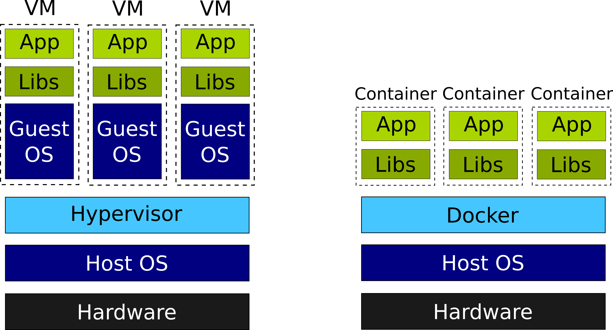

<!-- $theme: default -->
<!-- $size: 4:3 -->

# Linux Container: Ein Einstieg
Was steckt hinter Docker und co

---

## Programm

* Was sind Linux Container?
* Wie funktionieren sie? 
* Wie sind sie entstanden?
* Was kann man damit machen? 
* **Kein** Docker spezifischer Vortrag
* **Kein** Docker Tutorial
* Produktiver Einsatz von Docker Containern:
 -> anschließend Vortrag von Chris Jolly

----

# Was ist ein Linux Container?

Frei nach Wikipedia:

> Linux Container ist ein Oberbegriff für die Implementierung von Virtualisierung auf Betriebssystemebene in Linux.
>
> Derzeit existieren eine Reihe solcher Implementierungen, die alle auf den Virtualisierungs-, Isolierungs- und Ressourcenverwaltungsmechanismen des Linux-Kernels basieren.

---

# Was ist ein Linux Container?

Frei nach Wikipedia:

> Linux Container ist ein Oberbegriff für die Implementierung von ***Virtualisierung auf Betriebssystemebene*** in Linux.
>
> Derzeit existieren eine Reihe solcher Implementierungen, die alle auf den Virtualisierungs-, Isolierungs- und Ressourcenverwaltungsmechanismen des Linux-Kernels basieren.

---

## Was heißt das?

* Ich kann einzelne Prozesse von anderen auf meinem System isolieren
* Eine Anwendung in einem Container sieht andere Prozesse in dem Container und nur Resourcen, die im zugeteilt wurden und kann nicht ausbrechen
*  Host Linux kontrolliert die Ressourcen und sieht alle Prozesse

---

# Demo

---

# Wie ist das möglich? 😱

 
 

---

# Wie ist das möglich? 😱

Container entstehen durch die Kombination einiger Features im Linux Kernel

---

## Chroot

- Erlaubt es das root Verzeichnis `/` neu zu setzen
- Nützlich um von einem Live-Image aus den Bootloader wieder her zu stellen oder ein Passwort neu zu setzen
- Mit debootstrap könnte man sich zum Beispiel das Debian-Userland in Arch holen
- Noch **KEINE** Isolierung der Prozesse im chroot jail von den anderen (PIDs, user, ...) 

---

# Demo

---

## Namespaces

- API des Linux Kernel um **virtuelle System Ressourcen** wie Netzwerk Interfaces, Mount points, UserIDs und weitere System Ressourcen zu erstellen
- Diese Ressourcen können einzelnen Prozessen zugewiesen werden
- Namespaces können auch für sich genommen verwendet werden: Network Namespaces können zum Beispiel sehr nützlich sein um auf seinem eigenen Rechner virtuelle Netzerk Interfaces zu erstellen und damit ein Netzwerk zu simulieren

---

## Control Groups

- Management von **physisch System Ressourcen** wie CPU Zyklen, Arbeitsspeicher oder Netzwerk Bandbreite für Gruppen von Prozessen
- Prozesse können in ihrem Ressourcenverbrauch eingeschränkt werden
- Auch seperat Nutzbar

---

## Container sind keine Viruellen Maschinen!

 

---

### Vorteil Container
  - Effizienter
  - Einfacher zu managen
  - Modular
 
### Nachteil Container:
  - Näher am Host System als eine Virtuelle Maschine -> Potentiell Sicherheitsrisiko
  - Alle Container müssen mit den Features des Host-Kernel auskommen
  - _Fast_ nur Linux Container

---

### Vorteil VM: 
  - Egal welcher Kernel: Linux, BSD, NT, x64, x86
  - Stärkere Isolierung
  - Voller root Zugiff in der Virtuellen Maschine
  
### Nachteil VM:
  - Höherer Ressourcenverbrauch
  - Voller Kernel Boot, systemd, ...
  - Ganz oder gar nicht

---

# Ist das einen neue Erfindung?

---

***Nein***. Ähnliche Technologien und die Kernel Features existierten schon seit einer Weile.

---

**1979** - UNIX v7: `chroot` system call, später in BSD   

**2000** - FreeBSD Jails

**2001** - Linux Vserver ermöglicht erste virtualisierung auf Betrtriebssystemebene durch Kernel Patching

**2004** - Solaris Zones

**2007** - Control Groups in den Linux Kernel integriert 

**2008** - LXC: Linux Userspace tooling für cgroups und namespaces

---

- **2013** - ***Docker*** 
  - Entwicklerfreundliches Tooling
  - Daemon, der Container managed
  - Standartisierung
  - Packaging in Images
  - Docker Hub

--> Container werden für viele zugänglich und interessant für Entwickler

---

- Docker ist weit nicht die einzige Möglichkeit Container laufen zu lassen:
   -  LXD
  	-  garden runc,
  	-  Rocket
  	-  systemd nspawn
  	
 - Auch Flatpak und Snappy sind container technologien

---

# Praktische Anwendung

- **Konsolidierung** mehrerer Anwendungen ohne ineffiziente VMs
  
  
  
 
 

---

# Praktische Anwendung

- **Konsolidierung** mehrerer Anwendungen ohne ineffiziente VMs
- Weg aus der **Dependency Hell**
  
  
 
 

---

# Praktische Anwendung

- **Konsolidierung** mehrerer Anwendungen ohne ineffiziente VMs
- Weg aus der **Dependency Hell**
- Portable **Development Environments.** Verhindert "Works on My Machine" weil alle die gleiche Version haben
  
 
 
 

---

# Praktische Anwendung

- **Konsolidierung** mehrerer Anwendungen ohne ineffiziente VMs
- Weg aus der **Dependency Hell**
- Portable **Development Environments.** Verhindert "Works on My Machine" weil alle die gleiche Version haben
- **Isolierung** unsicherer Prozesse von einander
 
  

---

# Praktische Anwendung

- **Konsolidierung** mehrerer Anwendungen ohne ineffiziente VMs
- Weg aus der **Dependency Hell**
- Portable **Development Environments.** Verhindert "Works on My Machine" weil alle die gleiche Version haben
- **Isolierung** unsicherer Prozesse von einander
- Ermöglicht weitreichende **Orchestrierung** auf großen Rechner-Clustern mit Failover und großer Skalierung durch Lösungen wie Kubernetes

---

 

### @AnianZ

### ziegler@sicony.de

 

### **Wir suchen Backend Entwickler und DevOps Menschen!**

---

## Quellen

- [Wikipedia: Linux Container](https://en.wikipedia.org/wiki/Linux_containers)
- [TechSnap Podcast Folge 345](http://www.jupiterbroadcasting.com/119986/namespaces-goto-jail-techsnap-345/) Inspiration und Weitere Links
- [TechSnap Podcast Folge 349](http://techsnap.systems/349) Network Namespaces und Links dazu
- [Archwiki Chroot](https://wiki.archlinux.org/index.php/Change_root)
- [Linux Manpage Namespaces](http://man7.org/linux/man-pages/man7/namespaces.7.html)
- [Admin Magazin: Practical Benefits of Network Namespaces](http://www.admin-magazine.com/Archive/2016/34/The-practical-benefits-of-network-namespaces)
- [Wireguard and Network Namespaces](https://www.wireguard.com/netns/)
- [RHEL Documentation zu cgroups](https://access.redhat.com/documentation/en-us/red_hat_enterprise_linux/6/html/resource_management_guide/ch01)
- [Cannonical LXD Whitepaper](https://pages.ubuntu.com/container-whitepaper.html)
- [Pivotal Container History](https://content.pivotal.io/infographics/moments-in-container-history)
- [Entstehungsgeschichte BSD Jails vom Autor selbst](http://phk.freebsd.dk/sagas/jails.html) 
- [Container gibt es nicht](https://blog.jessfraz.com/post/containers-zones-jails-vms/): Unterschied zu Zones und Jails 

